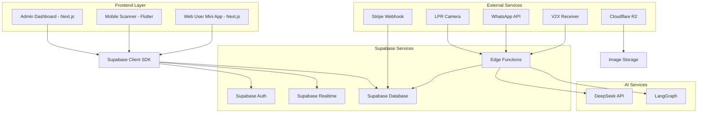
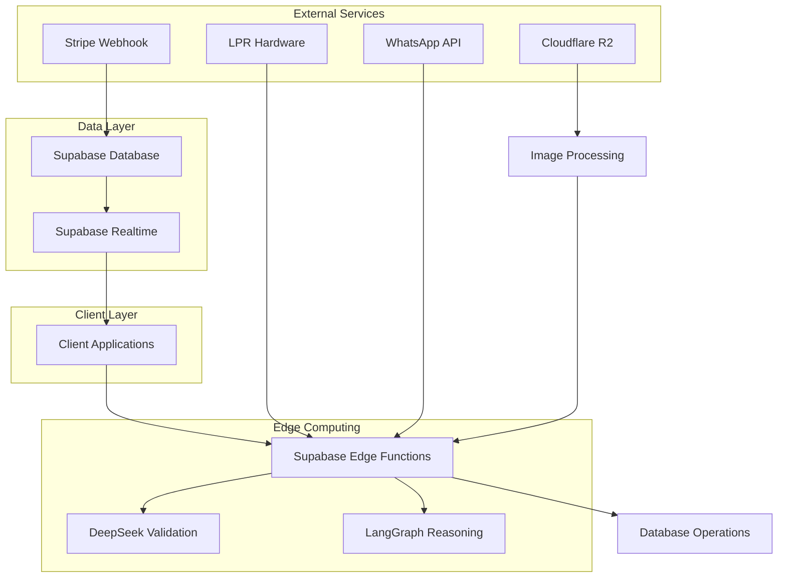
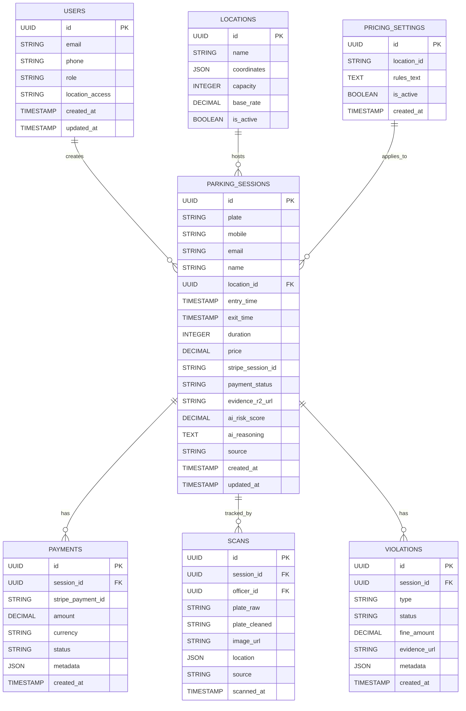

## 1. Architecture design



## 2. Technology Description
- **Web Frontend**: Next.js@14 + React@18 + TypeScript + Tailwind CSS
- **Mobile Frontend**: Flutter + Dart
- **Initialization Tool**: create-next-app (web), flutter create (mobile)
- **Backend**: Supabase (PostgreSQL + Realtime + Auth + Edge Functions)
- **AI Integration**: DeepSeek-R1 API + LangGraph for reasoning
- **Primary Data Source**: Stripe Webhooks → Supabase
- **Image Storage**: Cloudflare R2 (WebP format, max 1200px)
- **Optional**: WhatsApp Cloud API (Meta Business), LPR hardware-agnostic API
- **Design System**: Tactical UI with AI Violet (#6D28D9) and Dark Indigo (#1E1B4B)

## 3. Route definitions

### Admin Dashboard (Next.js)
| Route | Purpose |
|-------|---------|
| /admin/login | Role-based authentication (Admin vs Officer) |
| /admin/dashboard | Tactical dashboard with high-density real-time analytics |
| /admin/payments | Stripe revenue dashboard and payout management |
| /admin/users | User management with tactical data density |
| /admin/analytics | AI Analytics with DeepSeek Chatbot |
| /admin/enforcement | Cases and violation management |
| /admin/locations | Locations & Lots management |
| /admin/settings | Dynamic pricing rules and system configuration |
| /admin/integrations | LPR, Smart Sign, Smart Sticker configuration |

### Mobile Scanner (Flutter)
| Route | Purpose |
|-------|---------|
| /scanner | Tactical LPR Camera HUD with auto-detect |
| /scanner/results | Display scan results with tactical information |
| /scanner/violations | Report violations with tactical form interface |
| /scanner/history | Enforcement officer scan history |

### Web User Mini App (Next.js)
| Route | Purpose |
|-------|---------|
| / | Landing with phone authentication |
| /session | Current session validation and details |
| /payment | Stripe payment processing |
| /history | User parking history |
| /extend | Session extension with new Stripe link |

## 4. API definitions

### 4.1 Edge Functions (Supabase)
```typescript
// Plate Validation & Fuzzy Matching
POST /edge-functions/validate-plate
```
Request:
| Param Name| Param Type  | isRequired  | Description |
|-----------|-------------|-------------|-------------|
| plate     | string      | true        | License plate text (OCR raw) |
| source    | string      | true        | Source: 'lpr', 'whatsapp', 'manual' |
| location  | string      | false       | Location identifier |

Response:
| Param Name| Param Type  | Description |
|-----------|-------------|-------------|
| cleaned_plate | string | DeepSeek cleaned plate |
| confidence | number   | OCR confidence score |
| fuzzy_matches | array | Similar active sessions |

### 4.2 WhatsApp Webhook
```typescript
POST /edge-functions/whatsapp-webhook
```
Processes incoming WhatsApp messages through DeepSeek for plate extraction and session linking.

### 4.3 V2X Receiver
```typescript
POST /edge-functions/v2x-receiver
```
Ingests traffic data for dynamic pricing adjustments via lot_occupancy updates.

### 4.4 MCP Server Endpoints
```typescript
// AI Agent Integration
GET /mcp/list_spots
GET /mcp/check_price
POST /mcp/reserve_spot
GET /mcp/getLotAvailability
POST /mcp/createBooking
```

## 5. Server architecture diagram



## 6. Data model

### 6.1 Data model definition


### 6.2 Data Definition Language

**Core Parking Sessions Table**
```sql
-- parking_sessions (Primary data from Stripe webhooks)
CREATE TABLE parking_sessions (
    id UUID PRIMARY KEY DEFAULT gen_random_uuid(),
    plate VARCHAR(20) NOT NULL,
    mobile VARCHAR(20),
    email VARCHAR(255),
    name VARCHAR(100),
    location_id UUID REFERENCES locations(id),
    entry_time TIMESTAMP WITH TIME ZONE NOT NULL,
    exit_time TIMESTAMP WITH TIME ZONE,
    duration INTEGER DEFAULT 0,
    price DECIMAL(10,2) DEFAULT 0.00,
    stripe_session_id VARCHAR(255) UNIQUE,
    payment_status VARCHAR(20) DEFAULT 'pending',
    evidence_r2_url TEXT,
    ai_risk_score DECIMAL(3,2) DEFAULT 0.00,
    ai_reasoning TEXT,
    source VARCHAR(20) DEFAULT 'stripe',
    created_at TIMESTAMP WITH TIME ZONE DEFAULT NOW(),
    updated_at TIMESTAMP WITH TIME ZONE DEFAULT NOW()
);

-- Indexes for performance
CREATE INDEX idx_sessions_plate ON parking_sessions(plate);
CREATE INDEX idx_sessions_location_id ON parking_sessions(location_id);
CREATE INDEX idx_sessions_stripe_session ON parking_sessions(stripe_session_id);
CREATE INDEX idx_sessions_payment_status ON parking_sessions(payment_status);
CREATE INDEX idx_sessions_created_at ON parking_sessions(created_at DESC);

-- Enable realtime
ALTER TABLE parking_sessions REPLICA IDENTITY FULL;

-- RLS Policies
GRANT SELECT ON parking_sessions TO anon;
GRANT ALL PRIVILEGES ON parking_sessions TO authenticated;

-- Row Level Security
ALTER TABLE parking_sessions ENABLE ROW LEVEL SECURITY;
CREATE POLICY "Admins see all sessions" ON parking_sessions FOR ALL TO authenticated USING (auth.jwt() ->> 'role' = 'admin');
CREATE POLICY "Officers see location sessions" ON parking_sessions FOR ALL TO authenticated USING (auth.jwt() ->> 'role' = 'officer' AND location_id = ANY(string_to_array(auth.jwt() ->> 'locations', ',')::UUID[]));
CREATE POLICY "Users see own sessions" ON parking_sessions FOR ALL TO authenticated USING (auth.jwt() ->> 'role' = 'user' AND email = auth.jwt() ->> 'email');
```

**Pricing Settings Table**
```sql
-- Dynamic pricing rules (text-based for DeepSeek processing)
CREATE TABLE pricing_settings (
    id UUID PRIMARY KEY DEFAULT gen_random_uuid(),
    location_id UUID REFERENCES locations(id),
    rules_text TEXT NOT NULL,
    is_active BOOLEAN DEFAULT true,
    created_at TIMESTAMP WITH TIME ZONE DEFAULT NOW()
);

-- Sample data
INSERT INTO pricing_settings (location_id, rules_text, is_active) VALUES
('location_uuid', 'Base rate: $2/hour. Peak hours (8AM-6PM): +50%. Weekend: +25%. Overstay violation: $25 flat fee.', true);
```

**Scans Table**
```sql
-- All LPR/WhatsApp/manual plate inputs
CREATE TABLE scans (
    id UUID PRIMARY KEY DEFAULT gen_random_uuid(),
    session_id UUID REFERENCES parking_sessions(id),
    officer_id UUID REFERENCES users(id),
    plate_raw VARCHAR(50) NOT NULL,
    plate_cleaned VARCHAR(20),
    image_url TEXT,
    location JSONB,
    source VARCHAR(20) NOT NULL CHECK (source IN ('lpr', 'whatsapp', 'manual', 'mobile')),
    confidence_score DECIMAL(3,2),
    scanned_at TIMESTAMP WITH TIME ZONE DEFAULT NOW()
);

CREATE INDEX idx_scans_session_id ON scans(session_id);
CREATE INDEX idx_scans_plate_cleaned ON scans(plate_cleaned);
CREATE INDEX idx_scans_source ON scans(source);
CREATE INDEX idx_scans_scanned_at ON scans(scanned_at DESC);
```