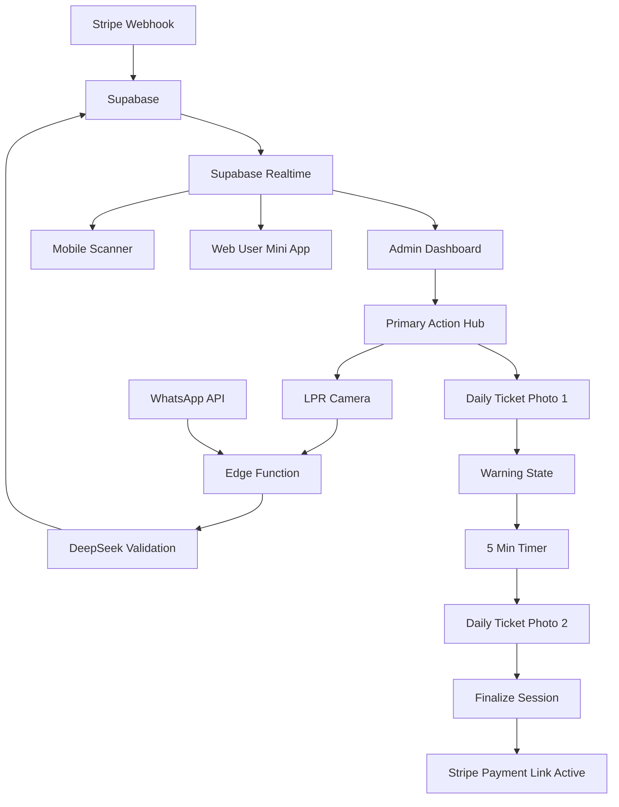

## 1. Product Overview
PayParq.ai is a full-stack, world-class parking management system with tactical admin dashboard, mobile scanner, and web mini app. **Stripe is the PRIMARY data source** - all session data originates from Stripe webhooks into Supabase, with LPR & WhatsApp as supplemental inputs.

The system eliminates parking tickets through AI-powered license plate recognition, automated payment processing, and real-time enforcement. Operators get tactical high-density dashboard UX, while users experience seamless phone-first parking with WhatsApp integration and AI reasoning via DeepSeek + LangGraph.

## 2. Core Features

### 2.1 User Roles
| Role | Registration Method | Core Permissions |
|------|---------------------|------------------|
| Admin | Email invitation | Full system access, user management, analytics, Stripe configuration, all locations |
| Enforcement Officer | Admin assignment | Mobile scanning, violation reporting, location-specific access only |
| End User | Phone verification | View sessions, make payments, receive WhatsApp notifications |

### 2.2 Feature Module
The PayParq.ai tactical system consists of:
1. **Admin Dashboard**: High-density terminal-style interface with sidebar (Enforcement, Intelligence, Management, Financials, System, Integrations), primary action hub, main data view, ghost sidebar for evidence/AI reasoning
2. **Mobile Scanner (Flutter)**: Tactical HUD with LPR camera, auto-detect plates, green=active session, red=passive camera, hardware-agnostic design
3. **Web User Mini App**: Metropolis-style session validation, payment history, extend session functionality, realtime updates

### 2.3 Page Details
| Page Name | Module Name | Feature description |
|-----------|-------------|---------------------|
| Admin Dashboard | Sidebar (Nerve Center) | Enforcement (Cases, Upload Case), Intelligence (AI Analytics, DeepSeek Chatbot), Management (Users, Locations & Lots, Add Guest/Pass/Sub), Financials (Billing, Payouts, Stripe Revenue Dashboard), System (Dynamic Pricing Rules, System Logs, Settings, Suspicious Alerts), Integrations (LPR, Smart Sign, Smart Sticker Download) |
| Admin Dashboard | Primary Action Hub | Scanner button opens LPR Camera HUD with auto-detect, Photo Upload for Warning (1 photo) or Daily Ticket (2 photos, 5 min apart), uploads to Cloudflare R2, creates/updates parking_sessions in Supabase, auto-creates Stripe Payment Link with status=Pending |
| Admin Dashboard | Main Data View (Terminal) | Search bar toggle by status (Active/Inactive), high-density table showing plate, mobile, name, email, status, inside view per session: location_id, entry_time, exit_time, duration, price, stripe_session_id, payment_status, evidence_r2_url, ai_risk_score, ai_reasoning |
| Admin Dashboard | Ghost Sidebar (Row Click) | Evidence photo from Cloudflare R2, Stripe session link + payment state, DeepSeek reasoning ("Frequent overstayer", "Payment abandoned", "Possible leakage pattern") |
| Mobile Scanner | Camera HUD | Tactical interface, green=active session, red=passive/warning camera, auto-detect plate, starts session automatically, hardware-agnostic LPR API design |
| Web User Mini App | Session Validation | "Session Validated" header, user history & active permits in left/top bar, current session details center, countdown or duration display, realtime updates, "Extend Session" CTA creates new Stripe link |
| Auth Page | Role-based Login | Dedicated login page, redirects based on role (Admin vs Officer), email/password for admins, phone verification for users |

## 3. Core Process

### Data Flow (Primary: Stripe → Supabase → Realtime)
1. **Stripe Webhook** sends session data → **Supabase** → **Realtime** updates dashboard + mobile + web app
2. **Daily Ticket Workflow**: 1st photo = Warning (session stays open, Stripe Pending), 2nd photo exactly 5 min later = finalize session (Stripe link active)
3. **LPR Input**: Optional, but IF used → **WhatsApp linking MANDATORY** via DeepSeek before session creation
4. **Edge Function**: All plate inputs (LPR/WhatsApp/Manual) → DeepSeek validation + fuzzy matching → Supabase update

### User Flows
**Admin Flow**: Login → Dashboard → Real-time data view → Actions via Primary Hub → Evidence review in Ghost Sidebar
**Officer Flow**: Mobile Scanner → Plate detection → Session creation/update → Violation reporting
**User Flow**: Phone auth → Session validation → Payment → Real-time updates → Session extension

## 4. User Interface Design

### 4.1 Design Style
- **Primary Color**: AI Violet #6D28D9 (actions, tactical indicators)
- **Background**: Dark Indigo #1E1B4B (main backgrounds, tactical contrast)
- **Text**: White/black with WCAG AAA contrast ratios
- **Button Style**: Sharp, tactical, minimal decoration, immediate feedback
- **Font**: High-density information display, professional typography for quick scanning
- **Layout**: Tactical grid layouts, minimal whitespace, maximum information density
- **Icons**: Professional, functional, no playful accents
- **Forbidden**: NO gold, NO gradients, NO consumer app patterns

### 4.2 Page Design Overview
| Page Name | Module Name | UI Elements |
|-----------|-------------|-------------|
| Admin Dashboard | Tactical Terminal | Dark background #1E1B4B, AI Violet #6D28D9 accents, high-density data table, minimal whitespace, professional iconography |
| Mobile Scanner | Tactical HUD | Full-screen camera, minimal overlay, green/red status indicators, auto-detect feedback, hardware-agnostic interface |
| Web User Mini App | Metropolis Style | Clean white background, tactical purple accents, session validation with checkmark, realtime status updates |

### 4.3 Responsiveness
Desktop-first tactical design with mobile adaptation. Admin Dashboard maintains high-density information on desktop while providing tactical mobile views. Mobile Scanner optimized for field enforcement. Web User Mini App provides tactical mobile experience with professional controls.

### 4.4 Tactical Requirements
- **Image Compression**: WebP format, max 1200px before Cloudflare R2 upload
- **Realtime Updates**: Sub-second response times for all status changes
- **AI Reasoning**: DeepSeek provides risk scores and reasoning visible in Ghost Sidebar
- **Dynamic Pricing**: Text-based rules in pricing_settings table, processed by DeepSeek
- **MCP Server**: Exposes list_spots, check_price, reserve_spot, getLotAvailability, createBooking for AI agents